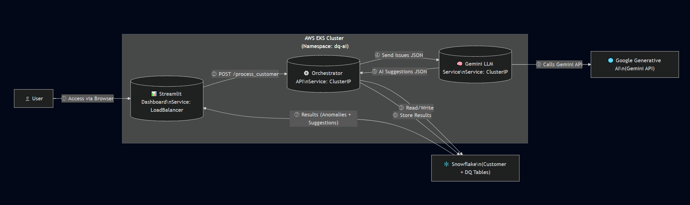

# 💳 CreditSense – AI-Powered Data Quality Monitoring

**CreditSense** is an AI-driven **data quality monitoring platform** designed for the financial domain.  
It detects anomalies in customer credit data, leverages LLMs for root cause analysis, and generates actionable AI-powered suggestions for data stewards.

🚀 Deployed on **AWS EKS**, it provides a scalable, cloud-native solution accessible via a web dashboard.

---

## 🌍 Live Demo

🔗 **Public Dashboard URL**: [CreditSense](http://ad51e1c09300e4e78a894f0d40ecd2d2-1190404559.us-east-1.elb.amazonaws.com/)  

---

## 📊 What It Does

### ✅ Anomaly Detection
The system automatically checks customer credit data for:
- **Missing Values** – Completeness checks
- **Negative Values** – Validity checks (e.g., negative income or credit)
- **Duplicates** – Uniqueness checks
- **Outliers** – Consistency checks (e.g., unusual amounts)

These anomalies are logged into **Snowflake tables** for auditability.

---

### 💡 AI Suggestions with Gemini
Detected anomalies are packaged and sent to the **LLM Service (Google Gemini)**.  
Gemini generates:
- **Fix suggestions** → Short, actionable recommendations.
- **Rule templates** → SQL or pseudocode for validation rules.
- **Root cause hypotheses** → Why the anomaly might exist.
- **Data lineage insights** → Relationships between affected tables.

The results are stored in **Snowflake**, making them queryable and traceable.

---

### 📊 Interactive Dashboard (Streamlit)
The business-facing **Streamlit Dashboard** provides:
- Input for **Customer ID**  
- **Summary banners** showing anomaly counts and severity  
- **AI-powered business-friendly suggestions**  
- **Business impact section** highlighting how data quality affects decision-making  
- Expandable **raw tables** for anomalies and AI suggestions (for technical users)

This ensures both **business stakeholders** and **data engineers** get value from the system.

---

### 📂 Dataset
We used a **sample subset of the Home Credit Dataset** (a well-known credit risk dataset), stored in Snowflake:
- **SAMPLE_APPLICATION**
- **SAMPLE_BUREAU**
- **SAMPLE_PREVIOUS_APP**
- **SAMPLE_INSTALLMENTS**

This mirrors real-world financial data quality monitoring needs.

---

## 🏗️ System Architecture

### 📸 Architecture Diagram
  

---

### 🔍 Architecture Explanation

1. **Frontend – Streamlit Dashboard**
   - Exposed to end-users through a **Kubernetes LoadBalancer**.
   - Lets business users enter a **Customer ID** and view results.
   - Communicates with the **Orchestrator API** to trigger anomaly checks and fetch suggestions.
   - Provides **visualizations** like summaries, business impact insights, and expandable raw data.

---

2. **Backend Services**
   - **Orchestrator API (FastAPI)**
     - Orchestrates the full pipeline when a user inputs a Customer ID.
     - Fetches raw data from Snowflake.
     - Runs anomaly checks (missing %, negatives, duplicates, outliers).
     - Calls the **LLM Service** with a combined summary of issues.
     - Stores anomalies + AI suggestions back into Snowflake.
     - Exposes endpoints `/process_customer` and `/healthz`.

   - **LLM Service – Gemini (FastAPI)**
     - Exposes `/analyze_combined` endpoint.
     - Uses **Google Gemini** model via `google.generativeai` SDK.
     - Ensures structured JSON outputs using strict schema parsing.
     - Extracts root cause, lineage, and actionable suggestions.

---

3. **Data Platform – Snowflake**
   - Stores:
     - **Raw Data** (SAMPLE_APPLICATION, SAMPLE_BUREAU, etc.)
     - **Anomalies** (`DQ_ANOMALIES`)
     - **AI Suggestions** (`DQ_AI_SUGGESTIONS`)
   - Provides SQL access for both anomaly detection logic and dashboard queries.
   - Serves as the **single source of truth**.

---

4. **Cloud Infrastructure – AWS**
   - **Amazon EKS (Elastic Kubernetes Service)**  
     - Runs the containerized workloads (dashboard, orchestrator, LLM API).
     - Provides scalability and high availability.

   - **Amazon ECR (Elastic Container Registry)**  
     - Stores Docker images (`dq-dashboard`, `orchestrator-api`, `llm-gemini`).
     - Integrated with EKS deployments.

   - **Kubernetes (Manifests in `k8s/`)**
     - **Deployments** → Manage pod lifecycles for each service.
     - **Services** → Internal communication (ClusterIP for APIs) + LoadBalancer for dashboard.
     - **ConfigMaps & Secrets** → Manage Snowflake credentials and API keys securely.
     - **Namespace `dq-ai`** → Keeps resources organized.

---

### 🔁 Flow of Events

1. User enters **Customer ID** in dashboard.  
2. Dashboard calls **Orchestrator API → /process_customer**.  
3. Orchestrator fetches raw data from Snowflake.  
4. Orchestrator runs anomaly detection rules.  
5. Orchestrator sends combined issues → **LLM Service**.  
6. LLM Service (Gemini) generates AI suggestions and lineage.  
7. Orchestrator stores anomalies + suggestions into Snowflake.  
8. Dashboard fetches results and visualizes them for the user.  
9. Business user sees **both raw data and business-friendly insights**.

---

## ⚙️ Tools & Technologies

- **Frontend**
  - Streamlit → UI

- **Backend**
  - FastAPI → APIs
  - Python (Pandas, Requests) → Data processing
  - Snowflake Python Connector → DB access
  - Google Gemini API → LLM integration

- **Data Platform**
  - Snowflake → Data storage & query engine

- **Infrastructure**
  - Docker → Containerization
  - Docker Compose → Local orchestration
  - Kubernetes → Pod & service orchestration
  - AWS EKS → Managed Kubernetes cluster
  - AWS ECR → Container registry
  - LoadBalancer Service → External dashboard access

---

## 🧑‍💻 Example Customer IDs

For testing the dashboard:

103065, 108032, 111950, 112961, 121072, 103788

---

## 💡 Business Impact

CreditSense helps financial institutions:
- Detect and remediate **data quality issues** early.
- Use AI to **prioritize fixes** by severity and business context.
- Gain **data lineage insights** for root cause analysis.
- Improve **compliance** and reduce risk in decision-making.

---

